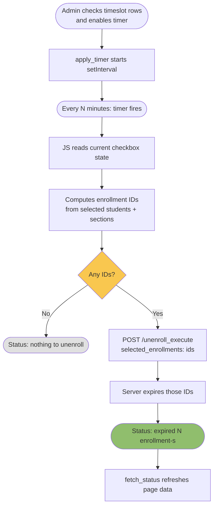
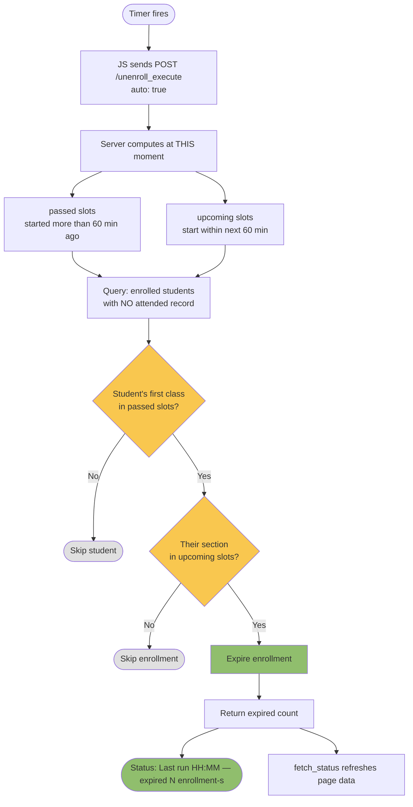

# Auto-Unenroll Timer — Manual Testing Guide

I used `bash seed.sh unenroll_seed.py` once at the start to wipe the DB and
load a clean dataset. All tests below assume that seed is in place unless
a re-seed is noted.

**Credentials:** `admin` / `adminadmin`  
**Test URL:** `http://localhost:8000/onsite/Splash/2026_Unenroll/unenroll_students`

---

## 1. Page Load — Verify Timer UI Renders

I logged in as `admin` and navigated to the unenroll page.

- "Auto-Unenroll Timer" box appears below the "Refresh Data" button
- Checkbox is unchecked (default `False`)
- Interval field shows `5` (default)
- `#timer_status` is empty
- Timeslot table renders correctly:
  - Period 1 — both columns checked ☑ ☑
  - Period 2 — right column only ☑
  - Period 3 — neither ☐ ☐

---

## 2. Manual Submit — Baseline (existing feature, must not be broken)

I left the default checkbox state (Period 1+2 both sides).

- Message reads: **"You have selected 4 students to be dropped from 4 classes (7 enrollments total)"**
- Clicked Submit → result page says **"Expired 7 student registrations"**
- Clicked **"Undo Unenroll"** → all 7 enrollments restored

---

## 3. Timer Settings Persist — Save and Reload

I checked Enable, changed interval to `2`, navigated away to `http://localhost:8000/`, then came back.

- Checkbox is still checked
- Interval field still shows `2`
- `#timer_status` shows "Timer active."

To verify the tags were saved: `http://localhost:8000/admin/tagdict/tag/` → searched `unenroll_timer` → two rows exist for the program with `True` and `2`.

To reset: deleted both `unenroll_timer_enabled` and `unenroll_timer_interval_minutes` rows from Django admin.

---

## 4. Timer Disabled — Does NOT Auto-Unenroll

I opened the unenroll page with the timer unchecked and waited 2 minutes.

- No enrollments expired
- Enrollment count message stayed at "7 enrollments total"
- `#timer_status` remained empty

---

## 5. Timer Enabled — Auto-Unenrolls on Interval

I set interval to `1` minute, checked Enable, and kept the tab open.

After ~1 minute:

- `#timer_status` updated to: `"Last run: HH:MM:SS — expired 7 enrollment(s)."`
- Enrollment count dropped to "0 students … 0 enrollments"
- Submit button became disabled

---

## 6. Timer Fires Again — Idempotent (Nothing Left)

Continuing from test 5, I waited another minute.

- `#timer_status` updated to: `"Last run: HH:MM:SS — nothing to unenroll."`
- No errors, no double-expiry

---

## 7. Interval Change — Timer Restarts with New Interval

I enabled the timer with interval `5`, then changed it to `1`.

- Old 5-minute timer was cleared
- New 1-minute timer started immediately
- `#timer_status` still showed "Timer active."
- Confirmed via DevTools → Network: a POST to `unenroll_timer` fired on interval change

---

## 8. Tab Closed — Timer Stops

I enabled the timer with interval `1`, then closed the tab immediately. After 2 minutes I reopened the page.

- Enrollments were **not** expired (timer died with the tab — by design)
- Page loaded with checkbox pre-checked (tag persisted), timer restarted fresh

---

## 9. Partial Selection — Timer Respects Admin's Checkbox Choice

I unchecked Period 2's timeslot columns so only Period 1 rows were selected,
then enabled the timer.

After the interval fired:

- Only Period 1 enrollments were expired
- Period 2 enrollments were **not** touched (those rows were not checked)
- `#timer_status` showed the correct count for Period 1 only

The timer reads the current checkbox state at each fire — the admin's selection
is the authoritative input for which timeslots to target.

---

## 10. Stale Data — Timer Handles It Cleanly

I opened the page in two tabs. In Tab 2 I manually submitted to expire all
enrollments. Switching to Tab 1 (stale data), I enabled the timer.

- Timer fired, sent `{selected_enrollments: []}` to `unenroll_execute` (no IDs — all already expired)
- Server returned `{expired: 0}`
- `#timer_status`: `"Last run: HH:MM:SS — nothing to unenroll."` — no crash

---

## Undo Cheat Sheet

| Situation | Action |
|---|---|
| Enrollments expired via Submit | Click "Undo Unenroll" on result page |
| Enrollments expired by timer | `bash seed.sh unenroll_seed.py` |
| Timer tags set wrongly | Delete rows from `http://localhost:8000/admin/tagdict/tag/` |
| Full reset | `bash seed.sh unenroll_seed.py` |

---

## How the Two Approaches Work

During development two implementation strategies were considered. Method 1 is
the one in the current draft PR. Method 2 is an alternative discussed but not
yet approved.

---

### Method 1 — Checkbox-driven (current draft PR)

The admin selects which timeslots to target using the existing checkboxes on
the page. The timer reads that selection on every fire and sends those
enrollment IDs to the server.

#### Real-World Example (Method 1)

**Setup (seed data):** Program has Period 1 (8:00–9:00) and Period 2 (9:30–10:30).

| Student | Checked In | Enrolled In |
|---|---|---|
| student_a | ✅ yes | Period 1 |
| student_b | ✅ yes | Period 1 |
| student_c | ❌ no | Period 1 + Period 2 |
| student_d | ❌ no | Period 1 |
| student_e | ❌ no | Period 1 + Period 2 |
| student_f | ❌ no | Period 2 only |

**Admin opens the page at 9:10 AM.** Period 1 has ended.
The timeslot table shows Period 1 no-shows in the unattended column.
Admin checks the Period 1 rows, sets interval to `60`, and enables the timer.

`poll_status` refreshes the enrollment data every 15 seconds so the JS has
fresh IDs well before the timer fires.

**At 10:10 AM the timer fires:**

- JS reads checkboxes → Period 1 is selected, Period 2 is not
- `selected_enrollments` = IDs for student_c (P1), student_d (P1), student_e (P1)
  plus student_c (P2) and student_e (P2) because their Period 2 slots were also in the selection
- student_a and student_b excluded — they have attended records in the JS data
- student_f excluded — admin did not check Period 2 rows

Result: `{ expired: 5 }` — 5 enrollments expired.

**Admin decision matters here.** If the admin had also checked Period 2 rows,
student_f would be included too. The timer acts exactly on what the admin selected.

---

### Method 2 — Server-side, time-driven (alternative, not yet approved)

The timer sends `{auto: true}` and the server recomputes `passed`/`upcoming`
timeslots from the current clock at fire time. No checkbox state is needed.

#### Real-World Example (Method 2)

Same seed data. **Admin enables the timer at 10:15 AM** without touching any
checkboxes.

At 10:15 AM the server computes:

- `passed` slots = started before 9:15 AM → **Period 1** qualifies (started 8:00)
- `upcoming` slots = start before 11:15 AM → **Period 1 and Period 2** qualify

| Student | First class in passed? | Action |
|---|---|---|
| student_a | ✅ Period 1 passed | **Safe** — has attended record |
| student_b | ✅ Period 1 passed | **Safe** — has attended record |
| student_c | ✅ Period 1 passed | **Dropped** from Period 1 + Period 2 |
| student_d | ✅ Period 1 passed | **Dropped** from Period 1 |
| student_e | ✅ Period 1 passed | **Dropped** from Period 1 + Period 2 |
| student_f | ❌ Period 2 not passed | **Safe** — first class not past threshold |

Result: `{ expired: 5 }`. At **11:15 AM** the timer fires again — Period 2 has
now passed, student_f gwheets dropped.

**The key difference:** Method 2 determines *who* to drop based on the clock
automatically. Method 1 drops *who the admin selected* based on checkboxes.
Both produce the correct result for their respective design goals.